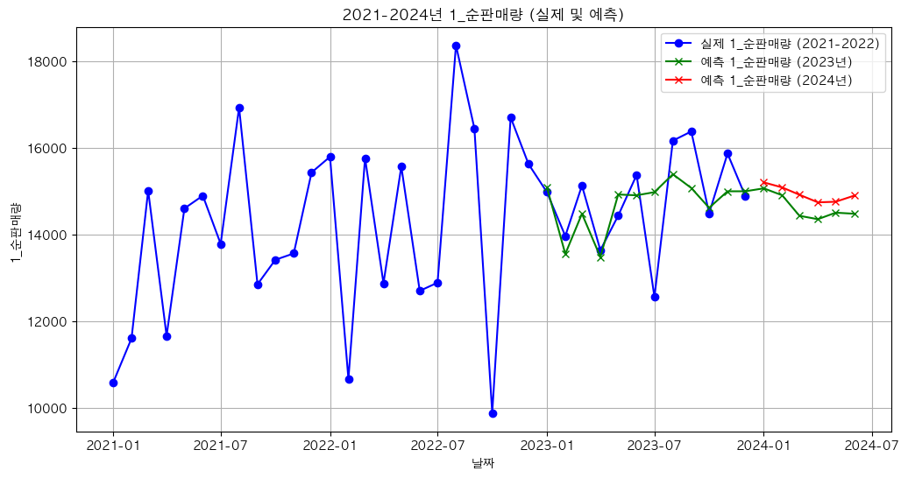

# 경제 지표와 트렌드를 반영한 중소 유통 물류 수요 예측

중소 유통물류센터의 거래 데이터와 경제 지표·검색 트렌드를 결합해, 라면 상품군 2개의 2024년 1~6월 월별 판매 수량을 예측한 프로젝트임.

- **구분:** 제3회 유통데이터 활용 경진대회(Retail Data Festa 2024) 수요예측 부문
- **기간:** 2024.09.24 ~ 2024.11.06 (예선 제출 10.18, 본선 발표 11.06)
- **팀:** 5인 팀 (본인: 데이터 수집부터 모델링·예측까지 전 과정)
- **성과:** **우수상** (산업통상자원부)
- **기술:** Python(pandas, scikit-learn, CatBoost, XGBoost, MLP), R(dplyr, ggplot2)

## 배경과 문제

| 구분 | 데이터 1 | 데이터 2 |
|---|---|---|
| 원천 거래 | 1,034,465행 | 593,150행 |
| 목표 상품군 | 중분류 `라면,통조림,상온즉석` | 대분류 `면류.라면류` |
| 예측 대상 | 월별 순판매량 | 월별 순판매량 |
| 학습 / 평가 | 2021~2022년 / 2023년 | 2021~2022년 / 2023년 |
| 최종 예측 | 2024년 1~6월 | 2024년 1~6월 |

제공된 거래 데이터(2021~2023년)와 공공·민간 지표를 활용해 상반기 판매 수량을 예측하고, 사용한 데이터와 근거를 제시하는 과제임.

## 접근 방법

1. **순판매량 정의:** 매출과 반품이 1:1로 맞지 않아 월별 매출 수량에서 반품 수량을 빼 순판매량을 만들고, 총 1,627,615행을 상품군별 36개월 시계열로 집계함.
2. **외부 변수:** 소비자물가지수·라면물가지수·코로나 확진자, 소비자심리·경제심리지수·음식료품판매액(KOSIS), 네이버·구글·카카오·유튜브 트렌드를 모으고 순판매량과의 상관관계로 고름.
3. **입력 변수:** 데이터 1은 음식료품판매액·유튜브트렌드·소비자물가지수, 데이터 2는 네이버트렌드·경제심리지수. 둘 다 월 더미 11개(첫 달 제외 원-핫)를 더함.
4. **평가:** 처음에는 무작위 분할로 비교했으나, 미래 기간을 예측하므로 2021~2022년 학습·2023년 평가로 바꿈.
5. **모델 선택:** 데이터 1은 CatBoost(GridSearchCV 27개 조합), 데이터 2는 MLP를 선택함.
6. **최종 예측:** 2021~2023년 데이터로 다시 학습해 2024년 상반기를 예측함.

## 결과

**2023년 평가 (MAE)**

| 데이터 | 최종 모델 | MAE | 비교 모델 MAE |
|---|---|---:|---|
| 데이터 1 | CatBoost (depth 4, learning_rate 0.05, iterations 500) | **658.54** | RandomForest 873.86, GradientBoosting 1,206.34, XGBoost 1,340.24, 선형 회귀 1,346.47 |
| 데이터 2 | MLP (hidden_layer_sizes=(100, 100), max_iter=500) | **510.22** | RandomForest 761.68, XGBoost 993.40, CatBoost 1,001.10 |

**2024년 상반기 예측 수량** (소수점 이하 버림)

| 월 | 데이터 1 | 데이터 2 |
|---|---:|---:|
| 2024.01 | 15,207 | 6,052 |
| 2024.02 | 15,091 | 5,870 |
| 2024.03 | 14,922 | 6,013 |
| 2024.04 | 14,747 | 6,147 |
| 2024.05 | 14,761 | 6,109 |
| 2024.06 | 14,901 | 5,958 |

- 데이터 1 비교 모델 중 GradientBoosting·RandomForest·XGBoost는 `random_state`를 지정하지 않아 실행마다 값이 달라짐. 제출 보고서의 값(GradientBoosting 753.30, RandomForest 1,084.21)은 이전 실행 결과이며, 표는 저장소 노트북에 저장된 출력임. CatBoost·MLP·선형 회귀는 실행해도 값이 같음.
- 데이터 1의 2023년 평가 구간은 CatBoost 조기 종료에도 사용한 구간임.
- MAE는 모델 오차 비교 결과이며 재고비용 절감률로 해석하지 않음. 2024년 실제 판매량과의 오차는 평가하지 않음.



## 폴더 구조

```
.
├── code/
│   ├── 01_preprocess_net_sales.R          # 매출·반품 분리, 월별 순판매량
│   ├── 02_external_variables.R            # 물가지수·평균기온 외부 변수 정리
│   ├── 03_correlation.ipynb               # 순판매량과 외부 변수 상관분석
│   ├── 04_model_comparison_data2.ipynb    # 데이터 2 모델 비교, MLP 최종 예측
│   ├── 05_final_forecast.ipynb            # 데이터 1 CatBoost 튜닝·모델 비교·최종 예측
│   └── 06_report_figures.R                # 보고서용 그림
├── results/                               # 노트북 출력 그림 (2023년 평가, 2021~2024 실제·예측)
├── docs/
│   ├── final_report.pdf                   # 본선 분석 보고서
│   └── HISTORY.md                         # 개발 과정
├── requirements.txt                       # Python 패키지
└── install_packages.R                     # R 패키지
```

## 실행 방법

데이터는 저장소에 포함하지 않음. 아래 파일을 `data/`에 두고 저장소 루트에서 순서대로 실행함(Python 3.12, R 4.6에서 확인).

| 파일 | 내용 | 출처 |
|---|---|---|
| `(1 데이터) 유통데이터 활용 경진대회 배포용.xlsx`, `(2 데이터) …xlsx` | 거래 데이터 | 대회 제공 |
| `생활물가지수_2020100__20241002205203.csv`, `수입물가지수_품목별__20241002231917.csv` | 물가지수 | KOSIS |
| `기온.csv` | 일별 기온 | 기상청 기상자료개방포털 |
| `최종 변수.csv` | 분석용 월별 변수표(2021.01~2024.06): `1_순판매량`, `2_순판매량`과 외부 지표 12개 | 01의 순판매량과 KOSIS·검색 트렌드를 월 단위로 합친 표 |

```powershell
pip install -r requirements.txt
Rscript install_packages.R

Rscript code/01_preprocess_net_sales.R     # 대회 데이터 → 월별 순판매량
Rscript code/02_external_variables.R       # 외부 지표 정리
jupyter nbconvert --to notebook --execute code/03_correlation.ipynb code/04_model_comparison_data2.ipynb code/05_final_forecast.ipynb
Rscript code/06_report_figures.R           # 보고서용 그림
```

- 재실행 시 데이터 1 CatBoost(MAE 658.54)와 데이터 2 MLP(MAE 510.22)의 2023년 평가와 2024년 예측값이 저장된 출력과 같게 나옴을 확인함.
- 중간 파일은 `data/`, R 그래프는 `Rplots.pdf`, 실행한 노트북은 `code/*.nbconvert.ipynb`로 저장됨. API 키는 필요 없음.

## 배운 점

- **목표 변수 정의가 먼저임.** 순판매량은 매출과 반품의 영향을 함께 받으므로, 수요 변화를 해석할 때는 두 흐름을 나눠 봐야 함.
- **표본 크기에 맞는 모델이 필요함.** 원천 거래는 160만 행이지만 학습 표본은 월 단위 24개였음. 집계 후 표본 수에 맞춰 모델 복잡도를 정해야 함.
- **검증 구간을 분리해야 함.** 모델 선택·조기 종료·최종 평가에 같은 구간을 쓰지 않도록 설계해야 함.
- **재현성을 남겨야 함.** 일부 모델에 seed를 고정하지 않아 보고서와 재실행 값이 달랐음.

## 팀과 역할

5인 팀으로 진행함. 본인은 외부 데이터 수집, 전처리·집계, EDA·시각화, 변수 설계, 모델 비교·튜닝, 평가·예측, 결과 정리와 활용방안 도출까지 전 과정에 참여함.

## 개발 과정

R로 판매 추이·순판매량을 정의(v0.1) → 무작위 분할 모델 비교(v0.2) → 날짜 기준 평가·튜닝(v0.3) → 예선 답안 제출(10.18) → 본선 자료·발표(v1.0, 11.06) 순서로 진행함. 단계별 변화와 이유는 [docs/HISTORY.md](docs/HISTORY.md)에 정리함.

## 자료

- [본선 분석 보고서](docs/final_report.pdf) — 데이터 확인, 전처리, 외부 변수, 모델 선정, 예측 결과, 활용방안
- [개발 과정](docs/HISTORY.md) — 단계별로 무엇을, 왜 바꿨는지
- [대회 페이지](https://festa.kdlc.or.kr/circulation/support/66ebe2249230dd20edbb0f72)
